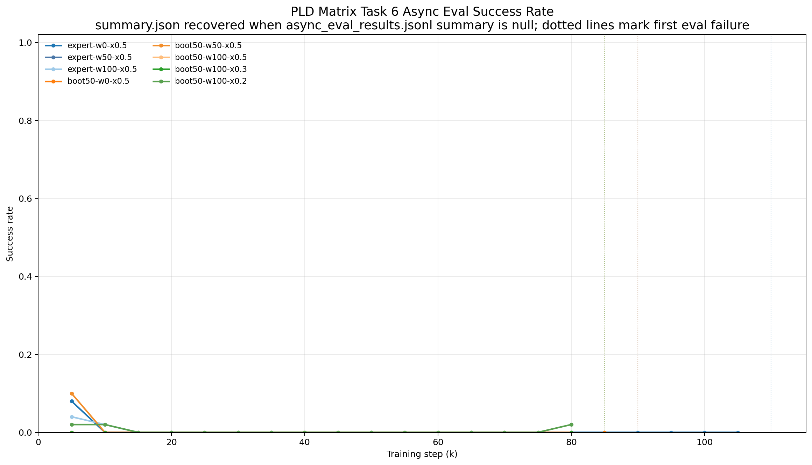
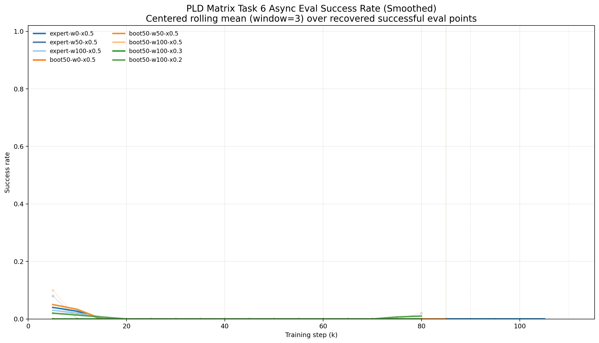
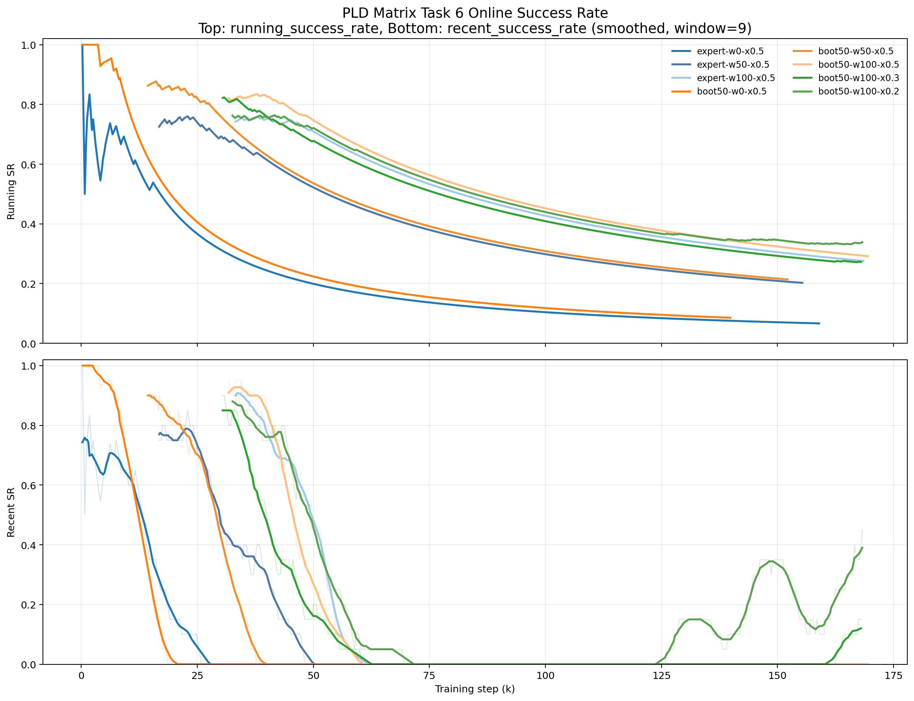

# LIBERO PLD Matrix Task 6 Async B128 训练结果梳理

Date: 2026-03-23

## 1. 范围与当前状态

本文档整理下面目录中的 8 组实验：

`/vla/users/niejunnan/codebase/serl_torch/examples/libero/outputs/libero/pld_matrix/task6_async_b128`

覆盖的 run：

- `m01_expert_w0_xi05`
- `m02_expert_w50_xi05`
- `m03_expert_w100_xi05`
- `m04_boot50_w0_xi05`
- `m05_boot50_w50_xi05`
- `m06_boot50_w100_xi05`
- `m07_boot50_w100_xi03`
- `m08_boot50_w100_xi02`

这批实验当前应视为 `2026-03-23` 的阶段性快照，而不是最终收官结果。

依据：

- 8 组 run 的配置目标都是 `training.max_online_env_steps=300000`
- 但当前日志只推进到大约 `140k-170k` env steps
- 当前没有看到活跃的 `train_residual_sac.py` 训练进程，但 8 个 `async_eval_watch.py` 进程仍然挂着，说明训练主体大概率已经停了，评估 watcher 还未退出

## 2. 这 8 组实验到底在比什么

### 2.1 命名含义

- `expert`：使用 expert offline 数据 `data/offline/libero_10_task_6`
- `boot50`：不使用 expert dataset，改为 `offline.bootstrap_base.enabled=true`，额外收集 `50` 个成功 episode 构建 offline buffer
- `w0 / w50 / w100`：对应 `training.warmup_base_episodes = 0 / 50 / 100`
- `xi05 / xi03 / xi02`：实际对应 `residual.xi = 0.5 / 0.3 / 0.2`

这里要特别注意：

- 文件名里的 `xi05` 不是 `0.05`，而是 `0.5`
- 这批实验的变量主要是三维：
  - offline 来源：`expert` vs `boot50`
  - 在线 base warmup：`0 / 50 / 100` episodes
  - residual 强度：`xi = 0.5 / 0.3 / 0.2`

### 2.2 共享配置

这 8 组 run 的共同设定包括：

- 任务固定为 `libero_10 task_id=6`
- `task.seed_base=7`
- `task.fixed_env_seed=7`
- `replay.batch_size=128`
- `training.max_online_env_steps=300000`
- `offline.ratio=0.5`
- `training.calql_pretrain.enabled=true`
- async eval 不是固定 seed：`training.async_eval.fixed_seed=None`
- async eval 每 `5000` steps 评估 `50` 个 episodes

关于 async eval，需要单独强调：

- 它不是像前面 `matrix` 实验那样在固定 eval seed 上跑
- 它用的是不断递增的 seed block，从 `seed_base=1000000` 开始
- 所以这批 eval 更接近“跨多个新 seed 的泛化检查”

代表配置：

- [m01 config](/vla/users/niejunnan/codebase/serl_torch/examples/libero/outputs/libero/pld_matrix/task6_async_b128/m01_expert_w0_xi05/2026-03-21/18-17-05/.hydra/config.yaml)
- [m04 config](/vla/users/niejunnan/codebase/serl_torch/examples/libero/outputs/libero/pld_matrix/task6_async_b128/m04_boot50_w0_xi05/2026-03-21/18-17-05/.hydra/config.yaml)

### 2.3 训练配置怎么理解

如果只看训练本身，这批 run 的核心配置可以概括成下面几类：

- 训练任务与环境：
  - `task.seed_base=7`
  - `task.fixed_env_seed=7`
  - 这意味着在线训练始终围绕固定训练 seed `7` 展开
- 在线训练预算：
  - `training.max_online_env_steps=300000`
  - 当前目录里的 run 还没有跑满这个预算
- Replay 与学习：
  - `replay.batch_size=128`
  - `offline.ratio=0.5`
  - `training.calql_pretrain.enabled=true`
- Offline 数据来源：
  - `expert` 组：`offline.dataset_paths=['data/offline/libero_10_task_6']`，同时 `offline.bootstrap_base.enabled=false`
  - `boot50` 组：`offline.dataset_paths=[]`，同时 `offline.bootstrap_base.enabled=true` 且 `success_episodes=50`
- 在线 warmup：
  - `w0 / w50 / w100` 对应 `training.warmup_base_episodes = 0 / 50 / 100`

这里最重要的训练配置结论只有一句话：

- 这批实验的在线学习，是在固定训练 seed `7` 上进行的

这也是为什么后面会出现“online 曲线还能涨，但 async eval 几乎为 0”的情况。更准确地说，很多 run 学到的是对训练 seed `7` 有效的策略，而不是对新 seed 普遍有效的策略。

### 2.4 评估配置怎么理解

这批实验的 async eval 配置与前面固定 eval seed 的 `matrix` 实验很不一样，关键项如下：

- `training.async_eval.enabled=true`
- `training.async_eval.every_steps=5000`
- `training.async_eval.episodes=50`
- `training.async_eval.seed_base=1000000`
- `training.async_eval.seed_stride=10000`
- `training.async_eval.fixed_seed=None`

这几项合起来的含义是：

- 每训练 `5000` steps，启动一轮异步评估
- 每轮评估跑 `50` 个 episodes
- 但这 `50` 个 episodes 不是反复在同一个固定 seed 上测
- 每一轮都会换一个新的 seed block

具体例子可以直接看 [m08 config](/vla/users/niejunnan/codebase/serl_torch/examples/libero/outputs/libero/pld_matrix/task6_async_b128/m08_boot50_w100_xi02/2026-03-21/18-17-05/.hydra/config.yaml) 和 [m08 10k eval summary](/vla/users/niejunnan/codebase/serl_torch/examples/libero/outputs/libero/pld_matrix/task6_async_b128/m08_boot50_w100_xi02/2026-03-21/18-17-05/async_eval/step_0010000/summary.json)：

- `5k` checkpoint 对应 `seed_base=1000000`
- `10k` checkpoint 对应 `seed_base=1010000`
- `15k` checkpoint 对应 `seed_base=1020000`
- 在 `10k` 的 `summary.json` 里能看到：
  - `seed_start=1010000`
  - `seed_next=1010050`
  - `fixed_seed=null`

这意味着：

- `10k` 那轮评估实际跑的是从 `1010000` 开始的连续 `50` 个 seed
- 下一轮会跳到新的 seed 段，而不是重复上一轮

所以这批 async eval 更接近“跨新 seed 的泛化评估”，而不是“在固定验证场景上的稳定复测”。

这也是为什么本文把这些 eval 结果解释成泛化信号，而不是简单当作训练过程中的噪声。

## 3. 结果总表

表中：

- `当前在线 SR` 与 `recent` 来自 `logs/episode_logs.jsonl` 的最后一条记录
- `最佳 eval` 与 `末次有效 eval` 来自 `async_eval_results.jsonl`；当其中 `summary=null` 时，本文回读对应 `async_eval/step_*/summary.json`
- `首次 eval 失败` 指 async eval 链路开始系统性报错的第一个 step

| 实验 | 真实设置 | 当前 env step | 当前在线 SR / recent | 最佳 eval | 末次有效 eval | 首次 eval 失败 |
| --- | --- | --- | --- | --- | --- | --- |
| `m01_expert_w0_xi05` | expert, `w=0`, `xi=0.5` | `158999` | `0.067 / 0.000` | `0.08 @ 5k` | `0.00 @ 105k` | `110k`, `arm_delta_limit` |
| `m02_expert_w50_xi05` | expert, `w=50`, `xi=0.5` | `155383` | `0.202 / 0.000` | `0.00 @ 5k` | `0.00 @ 85k` | `90k`, `arm_delta_limit` |
| `m03_expert_w100_xi05` | expert, `w=100`, `xi=0.5` | `168514` | `0.276 / 0.000` | `0.04 @ 5k` | `0.00 @ 80k` | `85k`, `action_dim` |
| `m04_boot50_w0_xi05` | boot50, `w=0`, `xi=0.5` | `139867` | `0.086 / 0.000` | `0.00 @ 5k` | `0.00 @ 85k` | `90k`, `arm_delta_limit` |
| `m05_boot50_w50_xi05` | boot50, `w=50`, `xi=0.5` | `152173` | `0.214 / 0.000` | `0.10 @ 5k` | `0.00 @ 80k` | `85k`, `eval.residual_scale` |
| `m06_boot50_w100_xi05` | boot50, `w=100`, `xi=0.5` | `169515` | `0.292 / 0.000` | `0.00 @ 5k` | `0.00 @ 80k` | `85k`, `action_dim` |
| `m07_boot50_w100_xi03` | boot50, `w=100`, `xi=0.3` | `168009` | `0.273 / 0.150` | `0.00 @ 5k` | `0.00 @ 80k` | `85k`, `eval.residual_scale` |
| `m08_boot50_w100_xi02` | boot50, `w=100`, `xi=0.2` | `168286` | `0.339 / 0.450` | `0.02 @ 5k/80k` | `0.02 @ 80k` | `85k`, `eval.residual_scale` |

## 4. 核心结论与依据

### 结论 1：这批实验当前最大的共同问题不是“后期 eval 挂了”，而是“挂掉之前泛化就已经很弱”

依据：

- 8 组里有 7 组在 `20k` 之后的 async eval 都已经是 `0.00`
- `m01` 只有 `5k=0.08`，之后到 `105k` 全是 `0.00`
- `m02` 从一开始就没有出现过正的 eval 成功率
- `m03` 只有 `5k=0.04`、`10k=0.02`，从 `15k` 开始归零
- `m04`、`m06`、`m07` 全程 eval 为 `0.00`
- `m05` 只有 `5k=0.10`，之后全部归零
- 只有 `m08` 保留了极弱但非零的 eval：`5k=0.02`、`10k=0.02`、`80k=0.02`

解释：

- 因为这批 async eval 不是固定 seed，而是不断换新的 seed block，所以这里的 `0.00` 更像是“跨 seed 泛化失败”
- 因此不能把这批结果解释成“只是 85k 之后评估链路坏了”
- 更准确的说法是：在 eval 链路失效之前，泛化本身就已经非常弱

### 结论 2：`warmup_base_episodes` 对在线训练明显有帮助，但主要体现在训练 seed 上，而不是泛化上

依据：

在 `xi=0.5` 下，expert 组随着 warmup 从 `0 -> 50 -> 100` 增加，当前在线 `running_success_rate` 依次变为：

- `m01`: `0.067`
- `m02`: `0.202`
- `m03`: `0.276`

boot50 组同样也有这个趋势：

- `m04`: `0.086`
- `m05`: `0.214`
- `m06`: `0.292`

在线峰值也呈现同样趋势：

- expert 组 `peak recent` 从 `1.00 @ 237 step`、`0.85 @ 22906 step`、到 `0.95 @ 34585 step`
- boot50 组 `peak recent` 从 `1.00 @ 293 step`、`0.90 @ 14360 step`、到 `0.95 @ 31738 step`

解释：

- warmup 不是把日志里的 success rate 直接“刷高”，因为 `episode_logs.jsonl` 里统计的 phase 只有 `residual_rl`
- 更合理的解释是：先做更多 base warmup，确实提升了 residual RL 在固定训练 seed `7` 上的后续学习稳定性
- 但对应的 async eval 没有同步变好，所以这个帮助主要是“训练分布内”的

### 结论 3：`boot50` 相比 `expert` 并没有带来决定性的提升

依据：

在相同 warmup 下做横向比较：

- `w=0`：`m01` 在线 `0.067`，`m04` 在线 `0.086`
- `w=50`：`m02` 在线 `0.202`，`m05` 在线 `0.214`
- `w=100`：`m03` 在线 `0.276`，`m06` 在线 `0.292`

这些差距都只有小幅提升，而且 async eval 基本没有改善：

- `m03` 最佳 eval 只有 `0.04`
- `m06` 最佳 eval 仍然是 `0.00`

offline 数据来源也很清楚：

- expert 组实际从 `data/offline/libero_10_task_6` 成功预加载了 `50` 个 PKL 文件和 `12756` 条 transition
- boot50 组没有 dataset paths，而是通过 bootstrap 收集了 `50` 个成功 episode，插入大约 `12455-12920` 条 transition

解释：

- 从当前结果看，`boot50` 至少没有把问题从根本上解决掉
- 它可能让 online 指标略有改善，但没有带来明显的泛化收益

### 结论 4：当前最值得保留的变量方向不是 `expert vs boot50`，而是降低 `xi`

依据：

在 `boot50 + w100` 这一组里，随着 `xi` 从 `0.5 -> 0.3 -> 0.2` 降低，后期在线稳定性明显改善：

- `m06 (xi=0.5)`：当前 `running=0.292`，`recent=0.000`，已经连续 `233` 个 episode 没有成功，最后一次成功在 `episode 143 / step 48355`
- `m07 (xi=0.3)`：当前 `running=0.273`，`recent=0.150`，只连续失败了 `1` 个 episode，最后一次成功在 `step 167489`
- `m08 (xi=0.2)`：当前 `running=0.339`，`recent=0.450`，最新 episode 仍然成功，连续失败为 `0`

`m08` 也是这批里当前在线表现最强的一组：

- 当前在线 `running_success_rate = 0.339`
- 当前 `recent_success_rate = 0.450`

解释：

- 虽然 `m07` 和 `m08` 的 async eval 也不强，但它们至少没有像 `xi=0.5` 那样在后期彻底塌掉
- 所以如果现在要继续投算力或做补评估，优先级应明显偏向更小的 `xi`

### 结论 5：很多 run 都出现了“早期很好看，后期一路滑落”的现象，说明这里有明显的过训练/脆弱策略问题

依据：

- `m04_boot50_w0_xi05` 的训练日志最典型：前 `20` 个 episode 左右在线 success rate 接近 `1.0`，之后持续下滑，到当前只剩 `0.086`
- `m01_expert_w0_xi05` 也类似：`peak recent = 1.0 @ 237 step`，但当前 `running=0.067`，并且已经连续 `276` 个 episode 失败
- `m05`、`m06` 也都出现了长尾连续失败：
  - `m05` 连续失败 `240` 个 episode
  - `m06` 连续失败 `233` 个 episode

解释：

- 这不是小波动，而是长时间的系统性回落
- 这说明当前设定下，策略很容易学到对训练 seed 有效但不稳定、不可持续的行为

### 结论 6：`m08_boot50_w100_xi02` 是当前最值得继续看的组，`m07_boot50_w100_xi03` 次之

依据：

- `m08` 是唯一当前还保持比较高 `recent_success_rate` 的 run：`0.450`
- `m08` 是这批里当前在线 `running_success_rate` 最高的 run：`0.339`
- `m08` 也是唯一在 `80k` 还能保留非零 eval 的 run：`0.02`
- `m07` 当前 `recent_success_rate=0.150`，也明显好于 `xi=0.5` 的所有组

限制：

- `m07` 和 `m08` 的 async eval 都在 `85k` 之后因 `eval.residual_scale` 配置漂移而失败
- 因此它们 `85k+` 的 checkpoint 目前缺少可信的跨 seed 验证

解释：

- 所以现在不能直接说 `m08` 就是最终最优
- 更准确的结论是：在现有证据下，`m08` 是当前最值得补统一评估的一组

### 结论 7：这批实验后半段还叠加了 eval 链路失效问题，因此 `85k+` 基本处于“盲飞”

依据：

- `m01` 的首次 eval 失败在 `110k`，原因是 `residual.arm_delta_limit`
- `m02`、`m04` 在 `90k` 首次失败，原因也是 `residual.arm_delta_limit`
- `m03`、`m06` 在 `85k` 首次失败，原因是 `action_dim`
- `m05`、`m07`、`m08` 在 `85k` 首次失败，原因是 `eval.residual_scale`

代表日志：

- [m03 fail log](/vla/users/niejunnan/codebase/serl_torch/examples/libero/outputs/libero/pld_matrix/task6_async_b128/m03_expert_w100_xi05/2026-03-21/18-17-05/async_eval/step_0085000/eval_runner.log)
- [m05 fail log](/vla/users/niejunnan/codebase/serl_torch/examples/libero/outputs/libero/pld_matrix/task6_async_b128/m05_boot50_w50_xi05/2026-03-21/18-17-05/async_eval/step_0085000/eval_runner.log)
- [m08 fail log](/vla/users/niejunnan/codebase/serl_torch/examples/libero/outputs/libero/pld_matrix/task6_async_b128/m08_boot50_w100_xi02/2026-03-21/18-17-05/async_eval/step_0085000/eval_runner.log)

解释：

- 所以后半段不能简单看作“没有结果”
- 更准确的说法是：后半段训练仍然推进了一段，但缺少可靠 eval 监督

## 5. 当前建议

如果现在就要给阶段性建议，可以写成下面几条：

1. 这批 `task6_async_b128` run 的主要瓶颈是泛化差，而不是单纯训练不收敛。
2. `warmup_base_episodes` 对固定训练 seed 上的在线表现有帮助，但不能解决跨 seed eval 低成功率的问题。
3. `boot50` 相比 `expert` 的边际收益有限，当前没有看到它明显优于 expert offline 数据。
4. 最值得继续保留和补评估的方向是更小的 `xi`，尤其是 `m08_boot50_w100_xi02`，其次是 `m07_boot50_w100_xi03`。
5. 在修复 `85k+` 的 async eval 配置漂移之前，不建议仅根据后半段在线 success rate 下最终结论。

## 6. 图表

### 6.1 Async Eval 曲线

原始图：

平滑图：

读图说明：

- 由于这批 `async_eval_results.jsonl` 里很多记录的 `summary=null`，图中已自动回读各自 `async_eval/step_*/summary.json`
- 淡色竖虚线表示各 run 首次 eval 失败的 step
- 从图上可以直观看到：大多数 run 的 eval 在非常早期就已经贴近 0，后面只是进一步缺少验证

### 6.2 Online Success 曲线

读图说明：

- 上图是 `running_success_rate`
- 下图是 `recent_success_rate` 的平滑曲线
- 这里能更清楚地看到：
  - warmup 增加会明显抬高 online 曲线
  - `xi=0.2 / 0.3` 的后期在线稳定性明显强于 `xi=0.5`

## 7. 一句话总结

截至 `2026-03-23`，`task6_async_b128` 这批实验表现出非常明显的“训练 seed 上能学、跨 seed 泛化差、后半段 eval 又失效”的特点；在当前 8 组里，最值得继续跟进的是 `m08_boot50_w100_xi02`，其次是 `m07_boot50_w100_xi03`，而 `xi=0.5` 的几组整体都已经显露出较强的后期退化。
