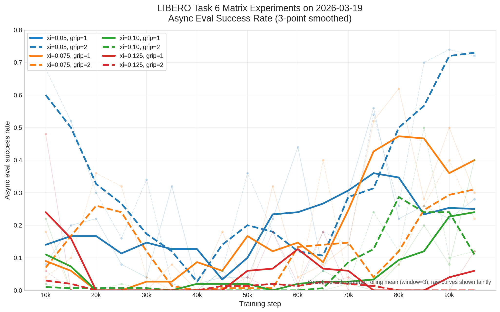

# LIBERO Task 6 Matrix 实验结论（仅 2026-03-19）

Date: 2026-03-23

本文档只总结 `2026-03-19` 这一天的 8 组 `matrix` 实验结论，并且遵循一个原则：

- 每给出一个结论，都同时给出详细依据；
- 依据优先来自原始运行产物，而不是主观印象。

## 1. 分析范围

本次只覆盖以下 8 组 run 在 `2026-03-19` 的训练结果：

- `train_residual_sac_task6_matrix_xi005_grip1`
- `train_residual_sac_task6_matrix_xi005_grip2`
- `train_residual_sac_task6_matrix_xi0075_grip1`
- `train_residual_sac_task6_matrix_xi0075_grip2`
- `train_residual_sac_task6_matrix_xi010_grip1`
- `train_residual_sac_task6_matrix_xi010_grip2`
- `train_residual_sac_task6_matrix_xi0125_grip1`
- `train_residual_sac_task6_matrix_xi0125_grip2`

实验变量只有两维：

- `xi ∈ {0.05, 0.075, 0.10, 0.125}`
- `grip1 / grip2 = residual.gripper_delta_limit 1.0 / 2.0`

## 2. 证据来源

本结论使用的证据主要来自下面几类文件：

1. 配置文件  
   `.../.hydra/config.yaml`

2. 异步评估结果  
   `.../async_eval_results.jsonl`

3. 训练收尾摘要  
   `.../summary.json`

4. 训练在线 episode 统计  
   `.../episode_logs.jsonl`

代表性路径示例：

- 配置：
  `/vla/users/niejunnan/codebase/serl_torch/examples/libero/outputs/libero/train_residual_sac_task6_matrix_xi005_grip1/2026-03-19/16-31-40/.hydra/config.yaml`
- 异步评估：
  `/vla/users/niejunnan/codebase/serl_torch/examples/libero/outputs/libero/train_residual_sac_task6_matrix_xi005_grip1/2026-03-19/16-31-40/async_eval_results.jsonl`
- 训练摘要：
  `/vla/users/niejunnan/codebase/serl_torch/examples/libero/outputs/libero/train_residual_sac_task6_matrix_xi005_grip1/2026-03-19/16-31-40/summary.json`

图表：

说明：

- 图中使用的是 `async_eval_results.jsonl` 里的成功率。
- 首个 `5k` 评估点统一失败，原因是环境连接未就绪，不代表策略质量，因此图中只画有效评估点。

## 3. 先给一张证据总表

| 实验 | 最佳评估 | 末次评估 | 峰值到末次回落 | 训练末在线 SR | 训练末 recent SR |
| --- | --- | --- | --- | --- | --- |
| `xi=0.05, grip=1` | `0.56 @ 75k` | `0.28 @ 95k` | `-0.28` | `0.350` | `0.400` |
| `xi=0.05, grip=2` | `0.74 @ 90k` | `0.72 @ 95k` | `-0.02` | `0.457` | `0.850` |
| `xi=0.075, grip=1` | `0.62 @ 80k` | `0.30 @ 95k` | `-0.32` | `0.295` | `0.550` |
| `xi=0.075, grip=2` | `0.40 @ 65k` | `0.22 @ 95k` | `-0.18` | `0.275` | `0.650` |
| `xi=0.10, grip=1` | `0.40 @ 95k` | `0.40 @ 95k` | `+0.00` | `0.244` | `0.650` |
| `xi=0.10, grip=2` | `0.50 @ 85k` | `0.12 @ 95k` | `-0.38` | `0.174` | `0.350` |
| `xi=0.125, grip=1` | `0.48 @ 10k` | `0.12 @ 95k` | `-0.36` | `0.137` | `0.250` |
| `xi=0.125, grip=2` | `0.06 @ 10k` | `0.00 @ 95k` | `-0.06` | `0.109` | `0.100` |

## 4. 结论与依据

## 结论 1：`xi=0.05, grip=2` 是这一天最强、也最稳的配置

### 依据

1. 它的最佳异步评估成功率是 8 组里最高的：
   - `0.74 @ 90k`

2. 它不是“只在某一个中间 checkpoint 突然冲高”，而是一直把高性能保持到了训练末尾：
   - `90k=0.74`
   - `95k=0.72`
   - 从峰值到末次只回落 `0.02`

3. 它的在线训练指标也最好：
   - 训练末在线 running success rate = `0.457`
   - 训练末 recent success rate = `0.850`

4. 它不仅比高 `xi` 组好，也明显优于最接近的对照组 `xi=0.05, grip=1`：
   - `best eval: 0.74 vs 0.56`
   - `last eval: 0.72 vs 0.28`
   - `final online running SR: 0.457 vs 0.350`

### 解释

这组配置同时满足三件事：

- 峰值高；
- 后期不崩；
- 训练末的在线表现和跨 seed 评估表现是同方向的。

因此它不是“偶然有一个好 checkpoint”，而是最接近稳定收敛的一组。

## 结论 2：`100k` 不是天然最佳停点，很多 run 在中期最好，后期回落

### 依据

1. 8 组里有 7 组的最佳评估点都不是最后一个 `95k` checkpoint：
   - `xi=0.05, grip=1` 最佳在 `75k`
   - `xi=0.05, grip=2` 最佳在 `90k`
   - `xi=0.075, grip=1` 最佳在 `80k`
   - `xi=0.075, grip=2` 最佳在 `65k`
   - `xi=0.10, grip=2` 最佳在 `85k`
   - `xi=0.125, grip=1` 最佳在 `10k`
   - `xi=0.125, grip=2` 最佳在 `10k`
   - 只有 `xi=0.10, grip=1` 的最佳点在 `95k`

2. 8 组里有 5 组从峰值到末次评估回落至少 `0.18`：
   - `xi=0.05, grip=1`: `0.56 -> 0.28`, 回落 `0.28`
   - `xi=0.075, grip=1`: `0.62 -> 0.30`, 回落 `0.32`
   - `xi=0.075, grip=2`: `0.40 -> 0.22`, 回落 `0.18`
   - `xi=0.10, grip=2`: `0.50 -> 0.12`, 回落 `0.38`
   - `xi=0.125, grip=1`: `0.48 -> 0.12`, 回落 `0.36`

3. 这些回落不是单点毛刺，而是持续性的：
   - `xi=0.05, grip=1` 在 `75k=0.56` 后，后续 `80k/85k/90k/95k` 分别只有 `0.22/0.26/0.22/0.28`
   - `xi=0.10, grip=2` 在 `85k=0.50` 后，`90k=0.10`，`95k=0.12`
   - `xi=0.125, grip=1` 在 `10k=0.48` 后，后面大部分 checkpoint 都接近 `0`

### 解释

这意味着：

- 用统一预算把所有 run 训练到 `100k` 是可以的；
- 但不能把“`100k` 的最后一个 checkpoint”直接等同于“这组配置的最好能力”。

更准确的说法应该是：

- `100k` 适合作为统一训练预算；
- 但模型选择应该额外看“`100k` 以内最佳 checkpoint”。

## 结论 3：低 `xi` 更稳，`xi>=0.10` 后整体明显变难

### 依据

1. 从最强结果看，低 `xi` 组整体更好：
   - `xi=0.05`: `0.56 / 0.74`
   - `xi=0.075`: `0.62 / 0.40`
   - `xi=0.10`: `0.40 / 0.50`
   - `xi=0.125`: `0.48 / 0.06`

2. 从训练末状态看，低 `xi` 的稳定性更明显：
   - `xi=0.05` 两组末次 eval 是 `0.28 / 0.72`
   - `xi=0.075` 两组末次 eval 是 `0.30 / 0.22`
   - `xi=0.10` 两组末次 eval 是 `0.40 / 0.12`
   - `xi=0.125` 两组末次 eval 是 `0.12 / 0.00`

3. `xi=0.125` 尤其说明问题：
   - `grip=1` 虽然 `10k` 有一次 `0.48`，但后面长期低位
   - `grip=2` 全程几乎没有学起来，`95k=0.00`

4. 从在线训练成功率看，随着 `xi` 提高，收尾时的 running SR 也整体下降：
   - `xi=0.05`: `0.350 / 0.457`
   - `xi=0.075`: `0.295 / 0.275`
   - `xi=0.10`: `0.244 / 0.174`
   - `xi=0.125`: `0.137 / 0.109`

### 解释

这批结果支持一个比较明确的经验判断：

- `xi=0.05` 是最安全的区间；
- `xi=0.075` 还能工作，但稳定性已经开始下降；
- `xi>=0.10` 后，训练越来越像“偶尔能打出高点，但很难稳住”；
- `xi=0.125` 基本已经过大。

## 结论 4：`grip2` 不是普遍更好，它只在最低 `xi` 下明显占优

### 依据

按同一 `xi` 下 `grip1 / grip2` 成对比较：

1. `xi=0.05`
   - `grip2` 明显优于 `grip1`
   - `best eval: 0.74 vs 0.56`
   - `last eval: 0.72 vs 0.28`
   - `final online running SR: 0.457 vs 0.350`

2. `xi=0.075`
   - `grip1` 更好
   - `best eval: 0.62 vs 0.40`
   - `last eval: 0.30 vs 0.22`
   - `final online running SR: 0.295 vs 0.275`

3. `xi=0.10`
   - `grip2` 有更高的瞬时峰值：`0.50 vs 0.40`
   - 但训练末更差：`0.12 vs 0.40`
   - 在线收尾也更差：`0.174 vs 0.244`
   - 说明 `grip2` 在这个 `xi` 下更像“放大波动”，而不是稳定增益

4. `xi=0.125`
   - `grip1` 明显优于 `grip2`
   - `best eval: 0.48 vs 0.06`
   - `last eval: 0.12 vs 0.00`
   - `final online running SR: 0.137 vs 0.109`

### 解释

这批实验不支持“把 gripper 动作放大到 `2.0` 总会更好”这个说法。

更准确的结论是：

- `grip2` 只在最低 `xi=0.05` 下表现出明显优势；
- 一旦 `xi` 往上走，`grip2` 的收益迅速变得不稳定，甚至会变成负作用。

## 结论 5：在线训练指标不能替代跨 seed 异步评估，模型选择必须看 eval

### 依据

1. 训练和评估使用的 seed 本来就不同：
   - 训练环境固定 seed 是 `7`
   - `2026-03-19` 的异步评估固定 seed 是 `3407`

2. 这导致一些 run 的“训练末 online 指标”并不能代表它的泛化表现：
   - `xi=0.075, grip=2`
     - 训练末 recent success rate = `0.650`
     - 但末次异步评估只有 `0.22`
   - `xi=0.10, grip=1`
     - 训练末 recent success rate = `0.650`
     - 但整段异步评估均值很低，直到 `95k` 才到 `0.40`
   - `xi=0.125, grip=1`
     - 训练末 recent success rate = `0.250`
     - 末次异步评估只有 `0.12`

3. 反过来，真正最好的 `xi=0.05, grip=2` 是 online 和 eval 同时都强：
   - online recent = `0.850`
   - last eval = `0.72`

### 解释

在这批实验里：

- 训练 online metric 更接近 “train distribution performance”；
- 异步评估更接近 “held-out fixed-seed validation”。

所以如果目标是选 checkpoint，而不是只看训练是否在当前 seed 上越来越会做，那么：

- 应该优先看异步评估；
- 不应该只根据 `episode_logs` 末尾的 recent success rate 选模型。

## 结论 6：这 8 组实验是在同一套 offline/no-bootstrap/no-warmup 条件下比较出来的，差异主要来自 `xi` 和 `gripper_delta_limit`

### 依据

1. 8 组在训练框架上是统一的：
   - `offline.enabled=true`
   - `offline.dataset_paths=['data/offline/libero_10_task_6']`
   - `offline.ratio=0.5`
   - `offline.symmetric_replay=true`
   - `training.calql_pretrain.enabled=true`
   - `training.calql_pretrain.steps=2000`

2. 8 组都没有开启 bootstrap：
   - 配置上 `offline.bootstrap_base.enabled=false`
   - 实际 summary 里 `bootstrap_stats.inserted=0`

3. 8 组都没有做在线 base warmup：
   - `training.warmup_base_episodes=0`
   - `training.warmup_base_steps=0`
   - `training.random_steps=0`

4. 8 组的 offline 数据规模也一致：
   - 每组 `offline_buffer_size=12756`

### 解释

这很重要，因为它意味着：

- 这里看到的性能差异，不是 bootstrap 或 warmup 带来的；
- 也不是某一组拿到了更多 offline 数据；
- 主要就是 `xi` 和 `gripper_delta_limit` 的作用差异。

换句话说，`2026-03-19` 这批实验可以看作一组相对干净的超参对比。

## 结论 7：如果只从 `2026-03-19` 这一天选后续保留配置，优先级应是 `xi=0.05, grip=2` > `xi=0.075, grip=1` ≈ `xi=0.05, grip=1`

### 依据

1. `xi=0.05, grip=2`
   - 最高峰值：`0.74`
   - 最稳收尾：`0.72`
   - 在线也最好：`0.457 / 0.850`

2. `xi=0.075, grip=1`
   - 最高峰值之一：`0.62`
   - 虽然回落，但仍明显优于大多数高 `xi` 组
   - 训练末 online recent = `0.550`

3. `xi=0.05, grip=1`
   - 次高稳定峰值：`0.56`
   - 比 `xi=0.075, grip=2`、`xi=0.10,*`、`xi=0.125,*` 更有保留价值

4. 不建议优先保留：
   - `xi=0.125, grip=2`：几乎没学起来
   - `xi=0.125, grip=1`：早期高点没有稳定保持
   - `xi=0.10, grip=2`：峰值高但后期掉得最明显之一

### 解释

如果目标是从 `2026-03-19` 里挑后续继续看的配置，而不是只挑单个 checkpoint，那么：

- `xi=0.05, grip=2` 明显应该放在第一位；
- 第二梯队更适合保留低 `xi` 的配置，而不是继续往 `0.10 / 0.125` 方向推。

## 5. 建议如何在后续文档里表述这批结果

建议把 `2026-03-19` 这批结果写成下面这种口径：

1. `2026-03-19` 的 8 组 matrix 实验是在统一的 offline replay + Cal-QL critic pretrain、无 bootstrap、无 online warmup 条件下完成的，因此差异主要来自 `xi` 和 `gripper_delta_limit`。
2. 最优配置是 `xi=0.05, grip=2`，它同时具备最高峰值和最稳定的后期表现。
3. 多个 run 存在“中期达到峰值、后期回落”的现象，因此 `100k` 更适合作为统一训练预算，而不是天然的最佳 checkpoint 选择点。
4. 较大的 `xi` 显著增加了不稳定性；`grip2` 只在最低 `xi` 下带来清晰收益。
5. 模型选择应优先基于异步评估，而不是仅看训练末的 online success rate。

## 6. 附录：8 组实验的完整有效评估序列

- `xi=0.05, grip=1`  
  `10k:0.08, 15k:0.20, 20k:0.22, 25k:0.08, 30k:0.04, 35k:0.32, 40k:0.02, 45k:0.04, 50k:0.04, 55k:0.22, 60k:0.44, 65k:0.06, 70k:0.30, 75k:0.56, 80k:0.22, 85k:0.26, 90k:0.22, 95k:0.28`

- `xi=0.05, grip=2`  
  `10k:0.68, 15k:0.52, 20k:0.30, 25k:0.16, 30k:0.34, 35k:0.02, 40k:0.00, 45k:0.06, 50k:0.36, 55k:0.18, 60k:0.00, 65k:0.18, 70k:0.14, 75k:0.54, 80k:0.26, 85k:0.70, 90k:0.74, 95k:0.72`

- `xi=0.075, grip=1`  
  `10k:0.18, 15k:0.00, 20k:0.00, 25k:0.00, 30k:0.00, 35k:0.08, 40k:0.00, 45k:0.18, 50k:0.00, 55k:0.32, 60k:0.04, 65k:0.08, 70k:0.14, 75k:0.52, 80k:0.62, 85k:0.28, 90k:0.50, 95k:0.30`

- `xi=0.075, grip=2`  
  `10k:0.04, 15k:0.10, 20k:0.36, 25k:0.32, 30k:0.04, 35k:0.00, 40k:0.00, 45k:0.00, 50k:0.02, 55k:0.00, 60k:0.00, 65k:0.40, 70k:0.02, 75k:0.02, 80k:0.08, 85k:0.26, 90k:0.40, 95k:0.22`

- `xi=0.10, grip=1`  
  `10k:0.22, 15k:0.00, 20k:0.00, 25k:0.00, 30k:0.00, 35k:0.00, 40k:0.00, 45k:0.06, 50k:0.00, 55k:0.00, 60k:0.00, 65k:0.06, 70k:0.02, 75k:0.00, 80k:0.08, 85k:0.20, 90k:0.08, 95k:0.40`

- `xi=0.10, grip=2`  
  `10k:0.02, 15k:0.00, 20k:0.00, 25k:0.02, 30k:0.00, 35k:0.00, 40k:0.00, 45k:0.00, 50k:0.00, 55k:0.00, 60k:0.00, 65k:0.00, 70k:0.02, 75k:0.24, 80k:0.12, 85k:0.50, 90k:0.10, 95k:0.12`

- `xi=0.125, grip=1`  
  `10k:0.48, 15k:0.00, 20k:0.00, 25k:0.00, 30k:0.00, 35k:0.00, 40k:0.00, 45k:0.00, 50k:0.00, 55k:0.18, 60k:0.02, 65k:0.18, 70k:0.00, 75k:0.00, 80k:0.00, 85k:0.00, 90k:0.00, 95k:0.12`

- `xi=0.125, grip=2`  
  `10k:0.06, 15k:0.00, 20k:0.00, 25k:0.00, 30k:0.00, 35k:0.00, 40k:0.00, 45k:0.00, 50k:0.04, 55k:0.00, 60k:0.02, 65k:0.02, 70k:0.04, 75k:0.00, 80k:0.00, 85k:0.00, 90k:0.00, 95k:0.00`
