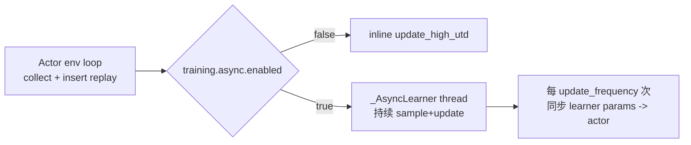

# RoboTwin Stage1/2 数据流向与维度说明（当前实现）

本文档按当前代码描述训练/评估的数据流、张量维度和关键变换。

适用文件：
- `examples/RoboTwin/scripts/train_residual_sac.py`
- `examples/RoboTwin/scripts/eval_residual_fast.py`
- `examples/RoboTwin/core/common.py`
- `serl_launcher/serl_launcher/agents/continuous/{drq.py,sac.py}`

## 1. 记号

- `Hc`: `residual.chunk_horizon`（默认 10）
- `Ab`: base action 维度（ALOHA 固定 14）
- `Ar`: residual action 维度（由 `residual.action_dim` 或 `action_indices` 决定）
- `K`: 图像路数 `len(residual.image_keys or sac.image_keys)`（1/2/3）
- `S`: 机器人状态维度 `obs["joint_action"]["vector"]`（ALOHA 常见 14）
- `B`: 训练 batch（默认 256）

当前残差策略输入状态维度：
- `state_fused_dim = S + Ab`
- ALOHA 常见：`14 + 14 = 28`

## 2. 在线交互主链路（训练与评估共用）

```mermaid
flowchart TD
    A[obs_raw] --> B[OpenPI infer_chunk]
    B --> C[base_chunk: (Hc,14)]
    C --> D[chunk 内每步 t]
    D --> E[build_residual_step_obs\nimages: K x (1,H,W,3)\nstate: (1,S+14)]
    E --> F[residual actor\na_res_raw: (Ar,)]
    F --> G[compose_residual_action\nclip[-1,1] -> clip[-xi_t,xi_t]\n*limits *residual_scale_t]
    G --> H[a_final: (14,)]
    H --> I[env.step(a_final)]
    I --> J[next_obs_raw,reward,done]
```

### 2.1 单步维度变化

1. OpenPI 输入（`encode_obs_for_openpi`）
- 图像：`HWC -> CHW`
- 状态：`state_openpi: (S,)`

2. OpenPI 输出
- `openpi_chunk: (Tpi,14)`
- `select_action_chunk_window` 后 `base_chunk: (Hc,14)`
  - `Tpi >= Hc`：截断
  - `Tpi < Hc`：末步 pad

3. 残差观测构建（`build_residual_step_obs`）
- `base_t: (14,)`
- `state_t: (S,)`
- `fused_state = concat(state_t, base_t): (S+14,)`
- 加时间维：
  - 每路图像：`(H,W,3) -> (1,H,W,3)`
  - `state: (S+14,) -> (1,S+14)`

4. 残差 actor 输出
- `a_res_raw: (Ar,)`

5. 动作组合（`compose_residual_action`）
- `a_res_clip = clip(a_res_raw, -1, 1)`
- `a_res_bound = clip(a_res_clip * xi_t, -xi_t, xi_t)`
- `delta_ctrl = a_res_bound * limits * residual_scale_t`（`(Ar,)`）
- 写入全 14 维：`delta_full: (14,)`
- `a_final = a_base + delta_full`（`(14,)`）

说明：
- `xi_t` 来自 `training.xi_scheduler`（或常量 `residual.xi`）。
- `residual_scale_t` 来自 phase 值 + `training.residual_scale_scheduler`（兼容项）。

## 3. Probing / Warmup 对数据流的影响

- Base probing：每个 episode 先跑 `T_base ~ U(0, alpha*T)`（`training/eval.probing_alpha`）。
- probing prefix 不写 replay（只做状态分布初始化）。
- warmup（训练）：`episode_id < warmup_base_episodes` 时 residual 强制为 0。

## 4. 训练 replay 写入与采样

### 4.1 replay 写入（每一步 1 条 transition）

- `observations`：
  - 图像：`K x (1,H,W,3)`
  - `state: (1,S+14)`
- `actions`: residual 原始动作 `a_res_raw`，形状 `(Ar,)`
- `next_observations`: 与 `observations` 同结构
- `rewards`: 标量
- `masks`: 标量（done=0 else 1）
- `dones`: bool

注意：
- step log 里的 `a_res` 是 **14 维已注入后的 delta**（`delta_full`）。
- replay `actions` 是 **Ar 维 residual 原始动作**（actor 学习空间）。

### 4.2 online/offline 混采

- `offline.symmetric_replay=true`：固定 1:1 混采
- 否则按 `offline.ratio` 采样
- 混采后 batch（以 1:1、`B=256` 为例）
  - online 128 + offline 128 -> 合并后 `actions: (256,Ar)`
  - `obs images: (256,1,H,W,3)`
  - `obs state: (256,1,S+14)`

## 5. 同步与异步更新路径



### 5.1 同步模式（`async=false`）

- 主线程在 env loop 里调用 `update_high_utd`
- 触发条件：
  - `len(replay) >= training_starts`
  - `global_policy_step % update_every == 0`
- 每次执行 `updates_per_step` 次更新

### 5.2 异步模式（`async=true`）

- 主线程仅采样 + 写 replay + 动作前向
- learner 线程持续从 replay 采样并更新
- 每 `training.async.update_frequency` 次 learner 更新，同步参数到 actor
- `update_every/updates_per_step` 仅在同步模式生效

## 6. DrQ/SAC 内部关键形状

- 编码器输入（每路图像）：`(B,1,H,W,3)`
- 展平时间维后喂视觉编码器
- 若 `use_proprio=true`：`state (B,1,S+14) -> (B,S+14)` 后再投影
- actor 输出：高斯 `mean/std: (B,Ar)`，采样动作 `(B,Ar)`
- critic 输入：`concat(obs_enc, action)`，双 Q 输出形状近似 `(2,B)`
- `utd_ratio=2`：一次 batch 内做 2 次 critic 更新 + 1 次 actor/temperature 更新
- OTF：`otf_num_samples=K` 时 next action 采样 `K` 份用于目标 Q 聚合

## 7. 离线数据导入（offline buffer）

- 若数据已是 residual 格式：直接规范化后入库
- 若是 expert 最终动作：在线调用 OpenPI 反解 residual

反解公式（受控维）：
- `a_res_raw = (a_expert[idx] - a_base[idx]) / (limits * xi * expert_reference_scale)`
- 可选 clip 到 `[-1,1]`
- 存入 replay 的 `actions` 维度仍是 `(Ar,)`

## 8. 评估链路差异

- 不进行参数更新
- 若 `eval.checkpoint_path` 为空：residual 全零，退化为 base-only
- `eval.residual_scale` 为常量；`xi` 使用 `residual.xi`
- 可选导出轨迹：`eval.collect_dataset_path`

## 9. 影响维度的关键配置

- `residual.image_keys`：改变 `K`
- `residual.action_dim` / `residual.action_indices`：改变 `Ar`
- `residual.chunk_horizon`：改变 `Hc`
- `sac.use_proprio`：影响状态分支是否参与编码
- `sac.encoder_type`：影响视觉编码器结构和特征维

