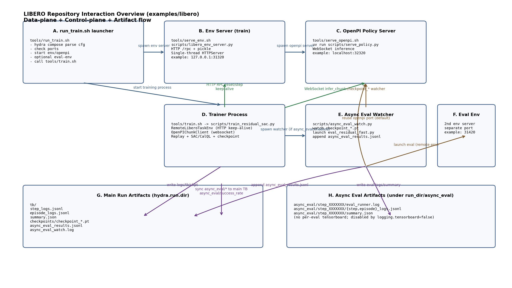
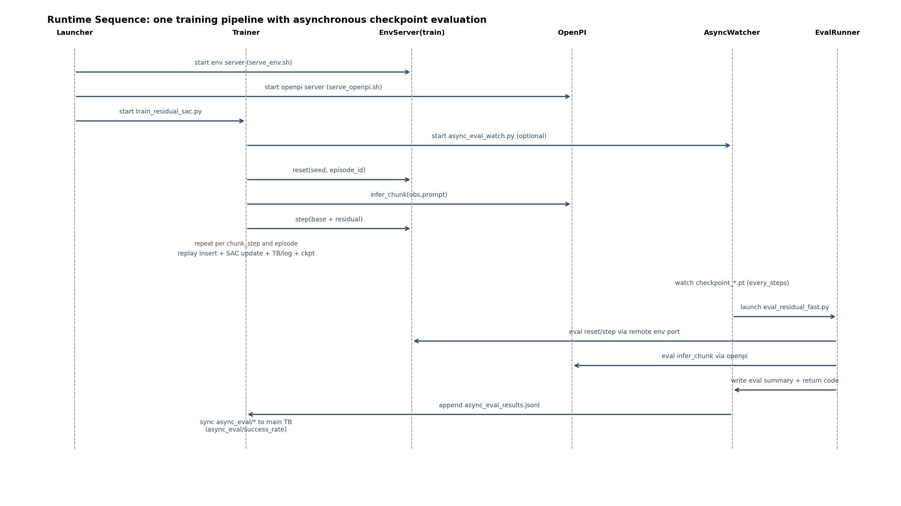

# LIBERO 仓库交互细节说明（examples/libero）

## 1. 图示

### 1.1 架构总览图

### 1.2 运行时序图（训练 + 异步评估）

## 2. 组件与职责

1. `tools/run_train.sh`
- 解析配置、检查端口冲突、启动服务、再拉起训练。
- 关键点：训练 env、异步评估 env、OpenPI 都由它编排。

2. `scripts/libero_env_server.py`
- 提供 HTTP RPC `/rpc`，请求与响应用 pickle 序列化。
- 关键点：服务端是单线程 `HTTPServer`，避免 MuJoCo/OpenGL 并发问题。

3. `env_wrappers/remote_task_env.py`
- 训练/评估侧的远程环境客户端。
- 关键点：默认复用 `HTTPConnection` + `Connection: keep-alive`，并带一次重连重试。

4. `tools/serve_openpi.sh` + OpenPI `serve_policy.py`
- 提供 base policy 推理服务。
- 训练脚本中 `OpenPIChunkClient` 通过 websocket client 进行 chunk 推理。

5. `scripts/train_residual_sac.py`
- 主训练循环：`reset -> openpi chunk -> residual action -> env step -> replay/update -> checkpoint`。
- 会启动 `async_eval_watch.py`（若开启 `training.async_eval.enabled`）。

6. `scripts/async_eval_watch.py`
- 监听 `checkpoint_*.pt`，按 `every_steps` 触发评估。
- 拉起 `scripts/eval_residual_fast.py`，并把结果写入 `async_eval_results.jsonl`。

7. `scripts/eval_residual_fast.py`
- 加载指定 checkpoint，使用 remote env + openpi 跑评估 episode。
- 产出 eval 侧 `summary.json`、step/episode logs。

## 3. 启动阶段交互（control-plane）

1. `run_train.sh` 先通过 Hydra compose 读出端口与异步评估开关。
2. 启动训练 env server，并等待端口 ready。
3. 若异步评估开启：
- 若评估端口与训练端口不同，启动（或复用）评估 env server。
4. 启动 OpenPI server，并等待 ready。
5. 启动 `train.sh`，最终进入 `train_residual_sac.py`。

## 4. 训练阶段交互（data-plane）

单回合主循环可抽象成：

1. `env.reset(seed, episode_id)`（remote RPC）
2. `openpi.infer_chunk(obs, prompt)`（websocket）
3. 对每个 chunk step：
- 构造 residual 观测；
- 采样 residual action（warmup/random/policy）；
- `final_action = compose(base_action, residual_action, xi, limits)`；
- `env.step(final_action)`（remote RPC）；
- 写 replay；
- 按条件进行 `agent.update_high_utd(...)`；
- 记录 step/episode/TB。
4. 每 `checkpoint_period` 保存 `checkpoint_*.pt`。

## 5. 异步评估交互

1. 训练进程启动 watcher 后，watcher 轮询 checkpoint 目录。
2. checkpoint 文件稳定后，watcher 启动一次 `eval_residual_fast.py`：
- `eval.checkpoint_path=.../checkpoint_XXXXX.pt`
- `hydra.run.dir=.../async_eval/step_XXXXXXX`
- `logging.tensorboard=false`（避免每次评估产生独立 TB）
3. 评估完成后，watcher把结果 append 到 `async_eval_results.jsonl`。
4. 训练主循环周期性增量读取 `async_eval_results.jsonl`，并写入主 TB：
- `async_eval/success_rate`
- `async_eval/status_ok`
- `async_eval/status_failed`
- `async_eval/duration_sec`
- 其他指标

## 6. 连接复用与协议细节

1. Env RPC
- 协议：HTTP/1.1 + POST `/rpc` + pickle body。
- 客户端复用连接：`RemoteLiberoTaskEnv` 维护 `_conn`，默认 keep-alive。
- 失败恢复：出现 transport error 会 close + reconnect，再重试一次。

2. OpenPI
- 客户端：`OpenPIChunkClient` 内部持有 websocket policy client。
- 推理接口：`infer_chunk(obs, prompt)`，返回 action chunk 和 timing。

3. 并发模型
- env server 单线程（减少 MuJoCo/GL 上下文冲突）。
- 训练可选 in-process async learner（`training.async.enabled`）。
- 异步评估由独立 watcher + 独立 eval 进程执行。

## 7. 主要产物路径

1. 主训练 run_dir（Hydra）
- `tb/`
- `step_logs.jsonl`
- `episode_logs.jsonl`
- `summary.json`
- `checkpoints/checkpoint_*.pt`
- `async_eval_results.jsonl`
- `async_eval_watch.log`

2. 异步评估子目录
- `async_eval/step_XXXXXXX/eval_runner.log`
- `async_eval/step_XXXXXXX/step_logs.jsonl`
- `async_eval/step_XXXXXXX/episode_logs.jsonl`
- `async_eval/step_XXXXXXX/summary.json`

## 8. 关键代码锚点

- 启动编排：`tools/run_train.sh`
- 训练入口：`tools/train.sh` -> `scripts/train_residual_sac.py`
- Env server：`scripts/libero_env_server.py`
- Env client：`env_wrappers/remote_task_env.py`
- OpenPI client：`policy/openpi_client.py`
- 异步评估 watcher：`scripts/async_eval_watch.py`
- 异步评估执行：`scripts/eval_residual_fast.py`
