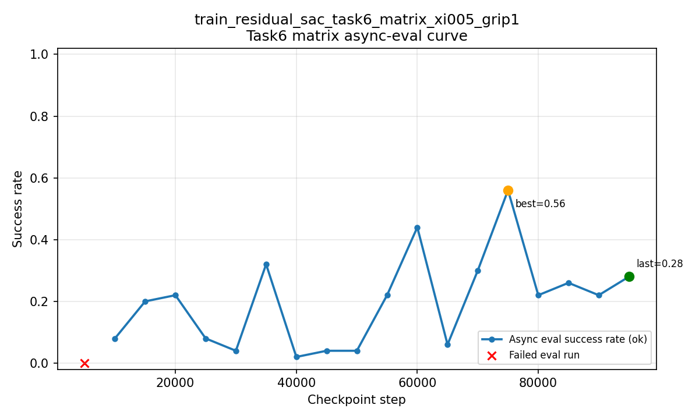
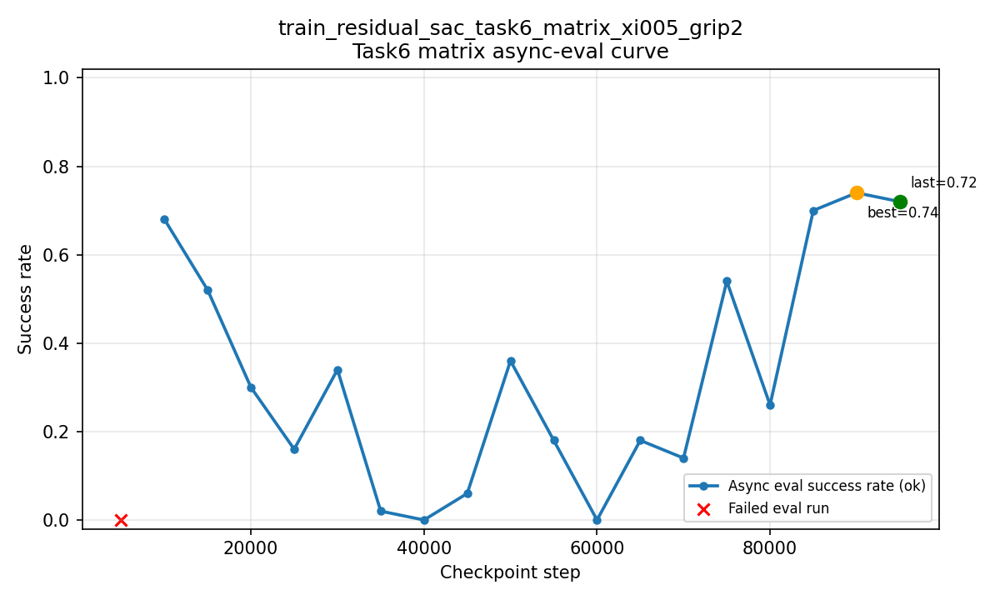
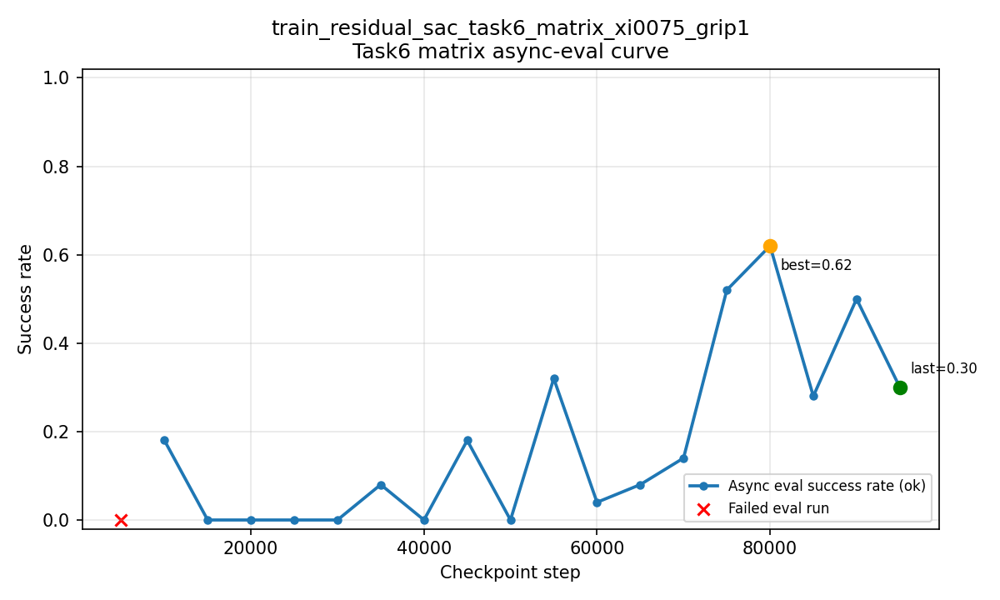
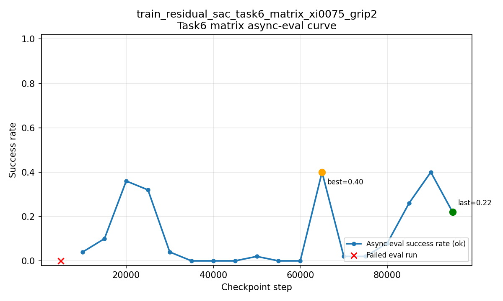
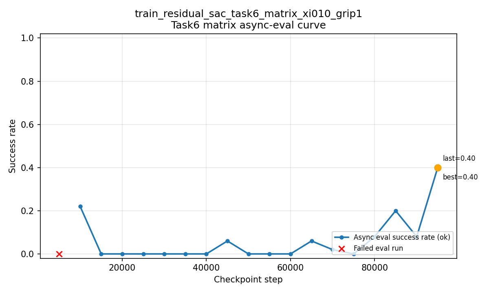
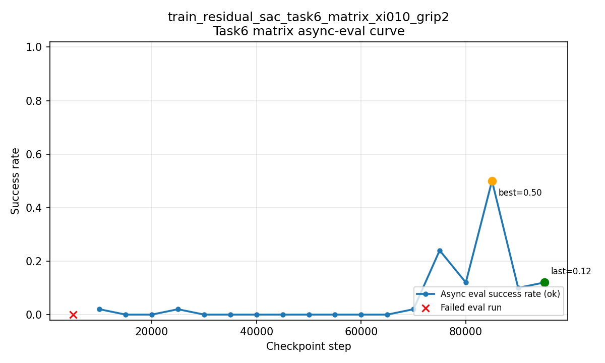
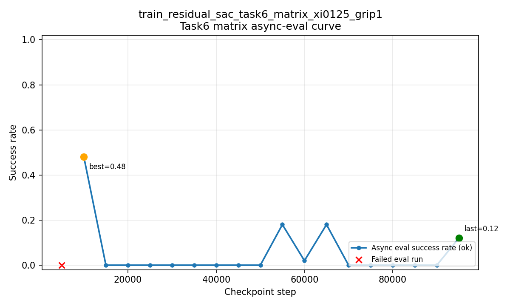
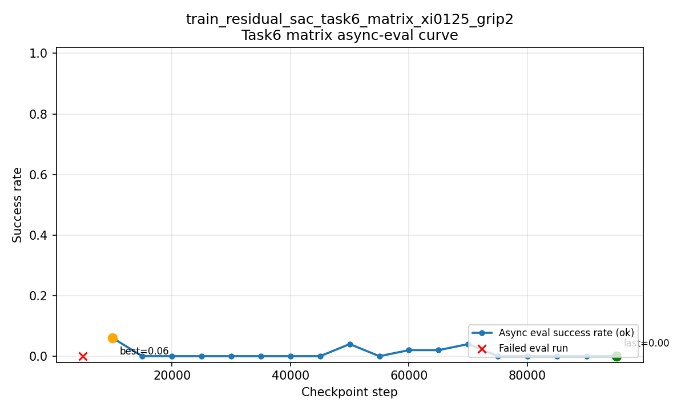

# Task6 Matrix 训练分析报告

> 分析范围：`outputs/libero/train_residual_sac_task6_matrix_*` 共 8 组实验（每组取最新一次 run）。
> 生成时间：2026-03-20 13:32:26

## 1. 总体结论

- 完成情况：8/8 组均跑满预算（`global_env_step = max_online_env_steps = 100000`）。
- 稳定最优组合：`xi=0.05, gripper_delta_limit=2.0 (grip2)`。
- 明显趋势：`xi` 增大后训练表现整体下降，`xi=0.125` 两组最差。
- 异步评估共性：每组都有 1 次失败（首个 5000 step 评估），主要原因是评估环境端口短暂未就绪（`ConnectionRefusedError`），之后均恢复。

## 2. 关键指标总表

| 实验 | 训练成功率(最终) | 训练近20局成功率 | 异步评估 last | 异步评估 last5均值 | 异步评估 best | 异步评估 mean | 异步评估(ok/fail) | 训练时长(h) |
|---|---:|---:|---:|---:|---:|---:|---:|---:|
| `train_residual_sac_task6_matrix_xi005_grip2` | 0.457 | 0.850 | 0.720 | 0.592 | 0.740 | 0.328 | 18/1 | 14.76 |
| `train_residual_sac_task6_matrix_xi005_grip1` | 0.350 | 0.400 | 0.280 | 0.308 | 0.560 | 0.200 | 18/1 | 16.15 |
| `train_residual_sac_task6_matrix_xi0075_grip1` | 0.295 | 0.550 | 0.300 | 0.444 | 0.620 | 0.180 | 18/1 | 14.96 |
| `train_residual_sac_task6_matrix_xi0075_grip2` | 0.275 | 0.650 | 0.220 | 0.196 | 0.400 | 0.127 | 18/1 | 14.74 |
| `train_residual_sac_task6_matrix_xi010_grip1` | 0.244 | 0.650 | 0.400 | 0.152 | 0.400 | 0.062 | 18/1 | 16.10 |
| `train_residual_sac_task6_matrix_xi010_grip2` | 0.174 | 0.350 | 0.120 | 0.216 | 0.500 | 0.063 | 18/1 | 14.89 |
| `train_residual_sac_task6_matrix_xi0125_grip1` | 0.137 | 0.250 | 0.120 | 0.024 | 0.480 | 0.054 | 18/1 | 14.81 |
| `train_residual_sac_task6_matrix_xi0125_grip2` | 0.109 | 0.100 | 0.000 | 0.000 | 0.060 | 0.010 | 18/1 | 14.96 |

## 3. 排名与效果解读

### 3.1 按训练最终成功率排序

1. `train_residual_sac_task6_matrix_xi005_grip2`: train=0.457, async_last5=0.592
2. `train_residual_sac_task6_matrix_xi005_grip1`: train=0.350, async_last5=0.308
3. `train_residual_sac_task6_matrix_xi0075_grip1`: train=0.295, async_last5=0.444
4. `train_residual_sac_task6_matrix_xi0075_grip2`: train=0.275, async_last5=0.196
5. `train_residual_sac_task6_matrix_xi010_grip1`: train=0.244, async_last5=0.152
6. `train_residual_sac_task6_matrix_xi010_grip2`: train=0.174, async_last5=0.216
7. `train_residual_sac_task6_matrix_xi0125_grip1`: train=0.137, async_last5=0.024
8. `train_residual_sac_task6_matrix_xi0125_grip2`: train=0.109, async_last5=0.000

### 3.2 按异步评估最近5次均值排序

1. `train_residual_sac_task6_matrix_xi005_grip2`: async_last5=0.592, train=0.457
2. `train_residual_sac_task6_matrix_xi0075_grip1`: async_last5=0.444, train=0.295
3. `train_residual_sac_task6_matrix_xi005_grip1`: async_last5=0.308, train=0.350
4. `train_residual_sac_task6_matrix_xi010_grip2`: async_last5=0.216, train=0.174
5. `train_residual_sac_task6_matrix_xi0075_grip2`: async_last5=0.196, train=0.275
6. `train_residual_sac_task6_matrix_xi010_grip1`: async_last5=0.152, train=0.244
7. `train_residual_sac_task6_matrix_xi0125_grip1`: async_last5=0.024, train=0.137
8. `train_residual_sac_task6_matrix_xi0125_grip2`: async_last5=0.000, train=0.109

### 3.3 结构化趋势（xi 与 grip）

- 同一 `xi` 下，`grip2` 相比 `grip1` 的提升在 `xi=0.05` 最明显。
- `xi=0.05` 是当前最稳区间；`xi>=0.10` 后整体性能快速衰减。
- `xi=0.125` 几乎没有有效学习信号（异步评估接近 0）。

## 4. 训练进度与异常检查

- 所有实验都有完整 checkpoint 序列至 `100000`。
- 各组 `train_residual_sac.log` 均有 `training done`，无主训练 traceback。
- 异步评估首轮失败（step=5000）后，后续评估持续产出，说明 watcher/评估流程可用。
- watcher 停止返回码存在 `0` 与 `-9` 两种；`-9` 出现在训练收尾阶段，不影响已落盘评估结果。

## 5. 每组异步评估可视化（每5000步）

### train_residual_sac_task6_matrix_xi005_grip1

- run: `/vla/users/niejunnan/codebase/serl_torch/examples/libero/outputs/libero/train_residual_sac_task6_matrix_xi005_grip1/2026-03-19/16-31-40`
- async eval: total=19, ok=18, fail=1, first_fail_step=5000, reason=ConnectionRefusedError
- curve summary: last=0.280, best=0.560, mean=0.200, last5_mean=0.308

### train_residual_sac_task6_matrix_xi005_grip2

- run: `/vla/users/niejunnan/codebase/serl_torch/examples/libero/outputs/libero/train_residual_sac_task6_matrix_xi005_grip2/2026-03-19/16-32-06`
- async eval: total=19, ok=18, fail=1, first_fail_step=5000, reason=ConnectionRefusedError
- curve summary: last=0.720, best=0.740, mean=0.328, last5_mean=0.592

### train_residual_sac_task6_matrix_xi0075_grip1

- run: `/vla/users/niejunnan/codebase/serl_torch/examples/libero/outputs/libero/train_residual_sac_task6_matrix_xi0075_grip1/2026-03-19/16-31-45`
- async eval: total=19, ok=18, fail=1, first_fail_step=5000, reason=ConnectionRefusedError
- curve summary: last=0.300, best=0.620, mean=0.180, last5_mean=0.444

### train_residual_sac_task6_matrix_xi0075_grip2

- run: `/vla/users/niejunnan/codebase/serl_torch/examples/libero/outputs/libero/train_residual_sac_task6_matrix_xi0075_grip2/2026-03-19/16-32-21`
- async eval: total=19, ok=18, fail=1, first_fail_step=5000, reason=ConnectionRefusedError
- curve summary: last=0.220, best=0.400, mean=0.127, last5_mean=0.196

### train_residual_sac_task6_matrix_xi010_grip1

- run: `/vla/users/niejunnan/codebase/serl_torch/examples/libero/outputs/libero/train_residual_sac_task6_matrix_xi010_grip1/2026-03-19/16-31-50`
- async eval: total=19, ok=18, fail=1, first_fail_step=5000, reason=ConnectionRefusedError
- curve summary: last=0.400, best=0.400, mean=0.062, last5_mean=0.152

### train_residual_sac_task6_matrix_xi010_grip2

- run: `/vla/users/niejunnan/codebase/serl_torch/examples/libero/outputs/libero/train_residual_sac_task6_matrix_xi010_grip2/2026-03-19/16-32-29`
- async eval: total=19, ok=18, fail=1, first_fail_step=5000, reason=ConnectionRefusedError
- curve summary: last=0.120, best=0.500, mean=0.063, last5_mean=0.216

### train_residual_sac_task6_matrix_xi0125_grip1

- run: `/vla/users/niejunnan/codebase/serl_torch/examples/libero/outputs/libero/train_residual_sac_task6_matrix_xi0125_grip1/2026-03-19/16-31-59`
- async eval: total=19, ok=18, fail=1, first_fail_step=5000, reason=ConnectionRefusedError
- curve summary: last=0.120, best=0.480, mean=0.054, last5_mean=0.024

### train_residual_sac_task6_matrix_xi0125_grip2

- run: `/vla/users/niejunnan/codebase/serl_torch/examples/libero/outputs/libero/train_residual_sac_task6_matrix_xi0125_grip2/2026-03-19/16-32-42`
- async eval: total=19, ok=18, fail=1, first_fail_step=5000, reason=ConnectionRefusedError
- curve summary: last=0.000, best=0.060, mean=0.010, last5_mean=0.000

## 6. 建议

1. 下一轮优先在 `xi=0.05` 附近做细化（例如 `0.03/0.04/0.05/0.06`），先锁定稳定区。
2. 保留 `grip2` 方向继续尝试，同时关注是否引入更高动作抖动。
3. 异步评估启动阶段增加环境就绪等待，可避免 5000 step 首次评估失败噪声。
